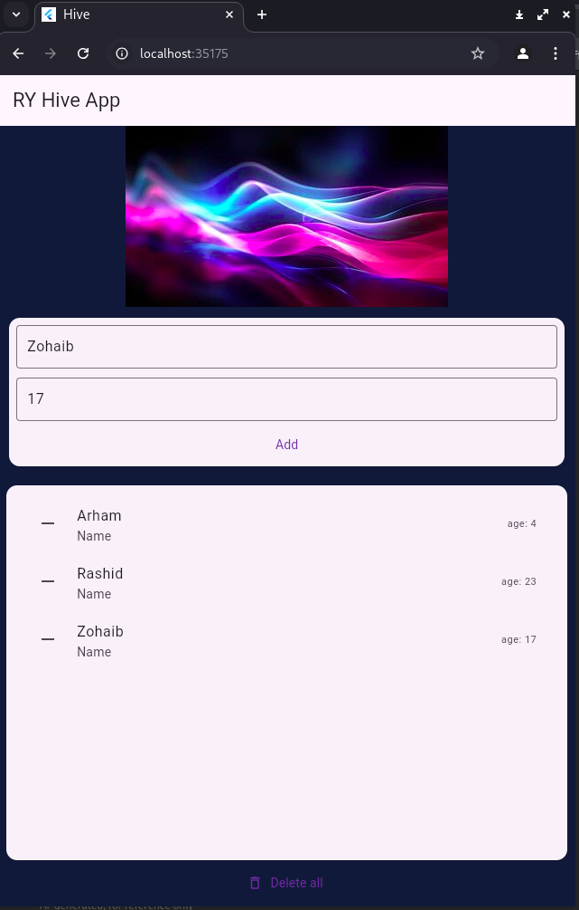

# Hive-Flutter

A simple Flutter project demonstrating local storage with Hive – a lightweight and blazing fast key-value database written in pure Dart.

---

## 📱 Features

- Add new entries (name & age)
- View all stored entries
- Delete single entries or all entries
- Reactive UI using `ValueListenableBuilder`

---

## 🖼️ Screenshots & Demo


### 🎞️ Demo


### 📷 Screenshot


---

## 🚀 Getting Started

### Prerequisites

- Flutter SDK
- Dart SDK
- Any Flutter-supported IDE (VS Code, Android Studio, etc.)

### Installation

```bash
git clone https://github.com/786RY9/Hive-Flutter.git
cd Hive-Flutter
flutter pub get
flutter packages pub run build_runner build
flutter run
